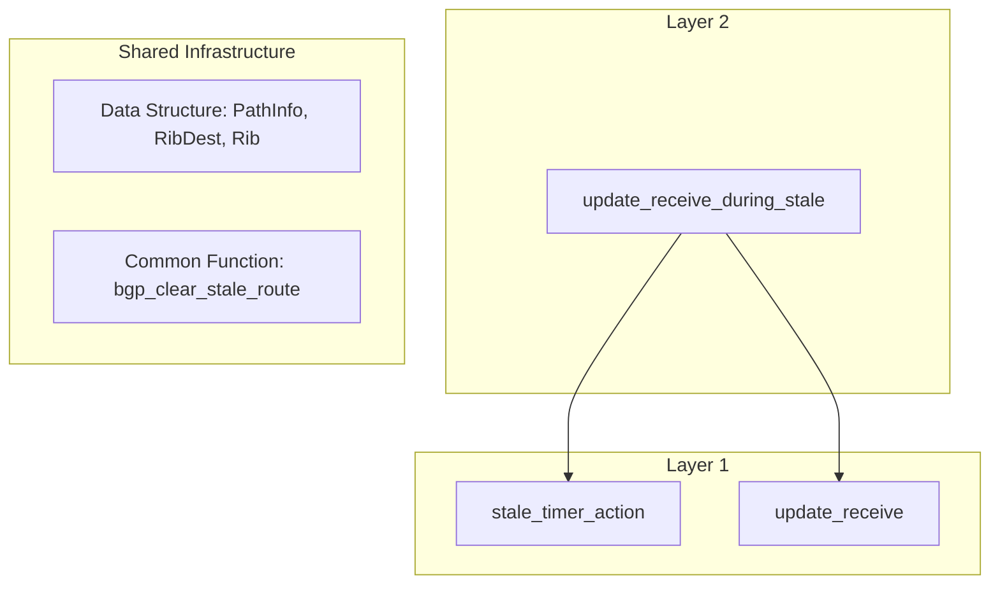
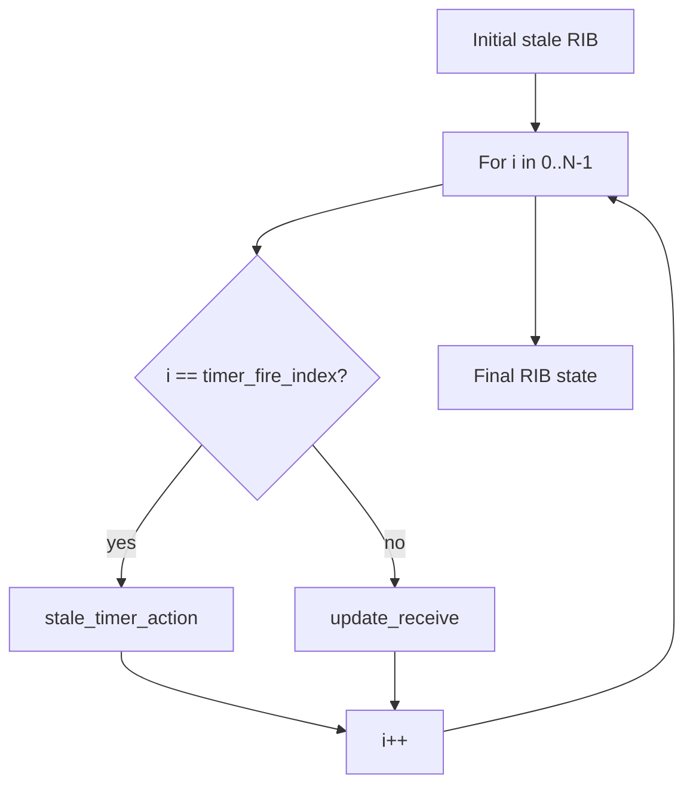
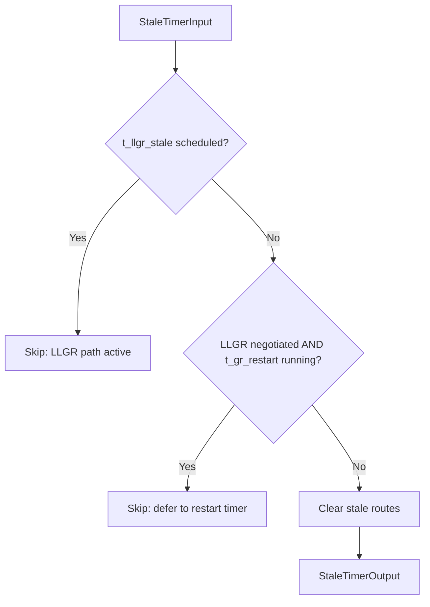
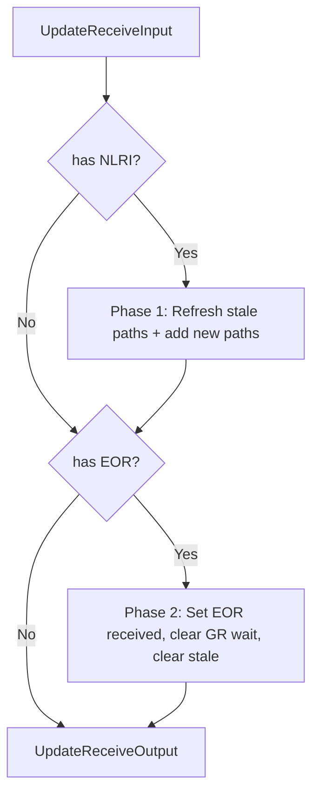

# BGP Graceful Restart Models

> Formal models for BGP Graceful Restart (RFC 4724) in FRRouting (FRR).

## Overview

BGP Graceful Restart involves complex state transitions across timers, RIB paths,
and per-AF flags. In FRR, the relevant logic is spread across multiple functions
in `bgp_fsm.c`, `bgp_route.c`, and `bgp_packet.c`, making it difficult to reason
about correctness by reading source code alone.

This module builds **formal Python models** of these FRR functions and uses
[CrossHair](https://github.com/pschan/crosshair) symbolic execution to
exhaustively explore all valid input combinations, generating high-coverage
test cases that are replayed against the real FRR implementation.

## Quickstart

### Prerequisites

- **Python 3.12** with `crosshair-tool` installed:
  ```bash
  pip install crosshair-tool typing_inspect
  ```

### Generating Test Cases

Run from this directory (`models/bgpd/graceful_restart/`):

```bash
# Generate all test cases
python format_tests.py

# Generate with coverage report
python format_tests.py --coverage

# List available CrossHair targets
python format_tests.py --list

# Generate only a specific model
python format_tests.py stale_timer_action
```

### Output

Test cases are written to `tests/`:

```
tests/
├── stale_timer_action_tests.json
├── update_receive_tests.json
├── update_receive_during_stale_tests.json
└── coverage_html/                 # HTML coverage report (with --coverage)
    └── index.html
```

## Model Architecture

The models follow a **two-layer architecture**:



- **Layer 1 (Function Models)**: Pure functions modeling individual FRR actions.
  Each takes an `Input` dataclass and returns an `Output` dataclass. No external
  state, no side effects — fully deterministic given inputs.

- **Layer 2 (Scenario Models)**: Compose Layer 1 functions to simulate multi-step
  GR scenarios. The scenario driver threads state (RIB, flags) through a sequence
  of Layer 1 calls and verifies behavioral properties like confluence.

- **Shared Infrastructure** (`bgp_utils.py`):
  - *Data Structure*: `PathInfo`, `RibDest`, `Rib` — mirror FRR's `bgp_dest` → `bgp_path_info` hierarchy.
  - *Common Function*: `bgp_clear_stale_route` — models the stale-route cleanup action used by both Layer 1 models.

## Scenario Model: `update_receive_during_stale`

**Source**: `update_receive_during_stale.py`
**Composes**: `update_receive` + `stale_timer_action`

This model targets the **Helper side** of GR process after the GR Restarter
reconnects. After the Helper and the Restarter re-establish BGP session, the
Helper receives UPDATE messages while `t_gr_stale` is still
running. The timer may fire at any point during the UPDATE sequence.

### Verified Property: Confluence

The key question: **does the final RIB state depend on when the stale timer
fires relative to the UPDATEs?** In a correct implementation, it should not.

```
For all valid timer_fire_index ∈ [0, len(updates)]:
    scenario(..., timer_fire_index=i).rib_after
    ==
    scenario(..., timer_fire_index=j).rib_after
```

In real FRR, timer firing is non-deterministic (depends on scheduling, load,
network latency). If the RIB state differed depending on timer timing, it
would indicate a **concurrency bug** in FRR's GR implementation.

### How It Works

The scenario driver uses a symbolic `timer_fire_index` to control when
`stale_timer_action()` is called relative to the UPDATE sequence:



CrossHair exhaustively explores all valid `timer_fire_index` positions and
all valid UPDATE sequences, confirming confluence holds for all explored states.

## Function Models

### `stale_timer_action`

**Source**: `stale_timer_action.py`
**FRR function**: `bgp_graceful_stale_timer_expire()` in `bgpd/bgpd.c`

Fires when `t_gr_stale` expires. Clears stale routes that were retained after
a peer disconnect, but **defers to LLGR** if the restart timer or LLGR timer
is still active.



**Key behaviors**:
1. **Skip if LLGR stale timer already scheduled** — `t_llgr_stale` is armed,
   so route clearing must wait.
2. **Skip if LLGR negotiated AND restart timer pending** — the restart timer
   has not yet decided whether to enter LLGR mode.
3. **Clear stale routes** — for each `(afi, safi)` where `nsf[afi][safi] == True`,
   remove all stale paths and trigger `bgp_process`.

### `update_receive`

**Source**: `update_receive_model.py`
**FRR function**: `bgp_update_receive()` in `bgpd/bgp_route.c`

Processes incoming BGP UPDATE messages. This model captures the **GR-relevant
subset** of UPDATE processing:



**Key behaviors**:
1. **Phase 1 — Normal UPDATE**: Refresh stale paths (remove `BGP_PATH_STALE` flag),
   add new paths to RIB.
2. **Phase 2 — EOR processing**: Set `BGP_PATH_EOR_RECEIVED`, clear
   `BGP_PATH_GR_WAIT_EOR`, call `bgp_clear_stale_route()` to remove all
   remaining stale paths.

The two phases are **not mutually exclusive** — a single UPDATE can carry both
NLRI and EOR. Phase 1 runs first (refresh), then Phase 2 (clear remaining stale).

## Test Cases

Generated test cases are JSON files in `tests/`.

| File | Model | Test Cases |
|------|-------|------------|
| `stale_timer_action_tests.json` | `stale_timer_action` | ~122 |
| `update_receive_tests.json` | `update_receive` | ~50 |
| `update_receive_during_stale_tests.json` | `update_receive_during_stale` | ~94 |

> Test case counts are approximate and may vary across CrossHair runs.

Each test case contains:
- **input**: Symbolic input values (RIB state, flags, UPDATE messages, etc.)
- **expected**: Model-predicted output (RIB after, flag changes, etc.)

These test cases are designed to be replayed against real FRR code via a C
GTest harness that drives the actual implementation and compares outputs.

## Coverage

When running with `--coverage`, an HTML coverage report is generated at:

```
tests/coverage_html/index.html
```

Coverage targets (per model source file):

| Model file | Description |
|------------|-------------|
| `stale_timer_action.py` | Stale timer action logic |
| `update_receive_model.py` | UPDATE receive GR-relevant logic |
| `update_receive_during_stale.py` | Scenario driver |

> Run `python format_tests.py --coverage` to
> generate the report and view actual coverage percentages.

## Directory Structure

```
models/bgpd/graceful_restart/
├── README.md                          # This file
├── bgp_utils.py                       # Shared BGP utilities (Rib, PathInfo, bgp_clear_*)
├── crosshair_utils.py                 # CrossHair seed builders
├── crosshair_target.py                # CrossHair symbolic execution targets
├── format_tests.py                    # Test case generator
├── stale_timer_action.py              # stale_timer_action model
├── update_receive_model.py            # update_receive model
├── update_receive_during_stale.py     # Scenario model
├── lib/                               # Shared infrastructure
│   ├── __init__.py                    # Common types: Afi, Safi, prefix_t
│   ├── types.py                       # Enums and dataclasses
│   ├── prefix.py                      # prefix_t ↔ IP prefix string mapping
│   ├── serializers.py                 # JSON serialization
│   └── testgen.py                     # CrossHair runner and test-gen engine
└── tests/                             # Generated test cases (output directory)
    ├── stale_timer_action_tests.json
    ├── update_receive_tests.json
    ├── update_receive_during_stale_tests.json
    └── coverage_html/                 # HTML coverage report (with --coverage)
```
